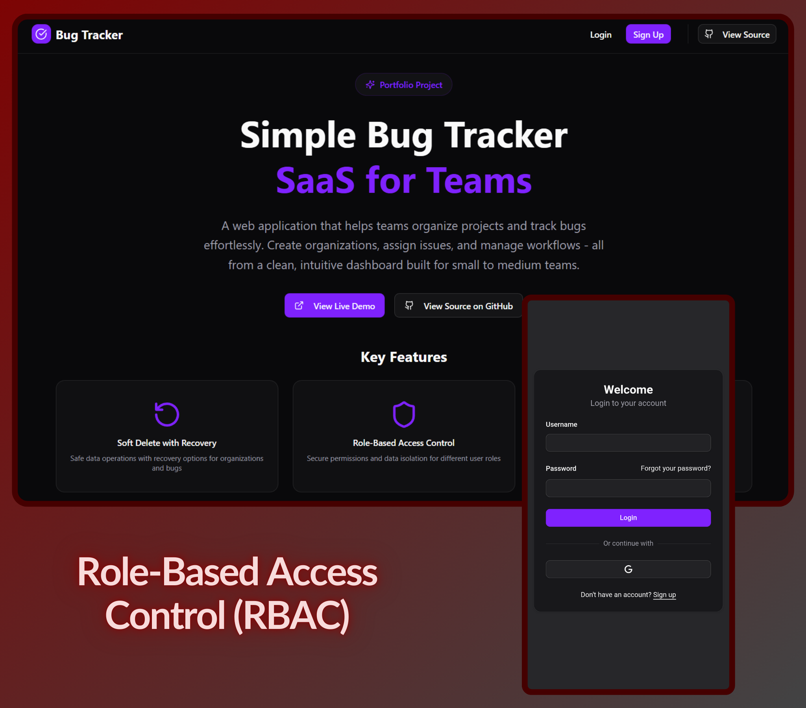

# 🐛 Bug Tracker SaaS

<div align="center">

[](https://nodejs.org/)
[](https://reactjs.org/)
[](https://nextjs.org/)
[](https://postgresql.org/)
[](https://prisma.io/)

**A production-ready, multi-tenant issue tracking platform with modern DevOps practices**



</div>

---

## ✨ Key Features

- **Multi-tenant architecture** - Organizations, projects, and issue tracking
- **Google OAuth2 + JWT authentication** - Secure login with google account
- **Role-based permissions** - Owner and member roles with backend enforcement
- **Join organizations with invite codes** - Secure team collaboration with invite codes
- **Soft delete with recovery** - 30-day recovery window for organizations
- **Safe destructive actions** - Confirmation flows for deletions and removals
- **Bug lifecycle management** - Status tracking (Open → In Progress → Closed) with priority levels
- **User dashboard** - Recent organizations and assigned issues at a glance

---

## 🛠️ Tech Stack

**Frontend:** React, Next.js, Tailwind CSS, ShadecnUI  
**Backend:** Node.js, Express, Prisma ORM, PostgreSQL  
**Authentication:** Google OAuth2, JWT, http-cookies, Brevo Email Service  
**DevOps:** Docker, GitHub Actions CI/CD, Vercel, Render

---

## 🚀 Production Highlights

- **Docker containerization** - Consistent environments across development and production
- **GitHub Actions CI/CD** - Automated linting, type checks, tests, and builds
- **Prisma ORM** - Type-safe database queries and schema migrations
- **Deployed on Render + Vercel** - Backend on Render, Frontend on Vercel
- **Google OAuth2 integration** - Secure authentication with Brevo email service
- **Security-first design** - Role enforcement at API level, not just UI

---

## 👥 User Roles

| Action | 👑 Owner | 👤 Member |
|:-------|:--------:|:---------:|
| Create/Edit/Delete Organization | ✅ | ❌ |
| Remove Members | ✅ | ❌ |
| Create Projects | ✅ | ✅ |
| Edit/Delete Projects | ✅ | ❌ |
| Create/Assign Bugs | ✅ | ✅ |
| Close Own/Assigned Bugs | ✅ | ✅ |

---

## 📦 Quick Start

```bash
# Clone and install
git clone <repo-url>
npm install

# Setup environment
cp .env.example .env

# Run migrations and start
npx prisma migrate dev
npm run dev
```
---

## 🔗 Links

**Live Demo:** [https://devbugs.vercel.app]  
**Repository:** [https://github.com/raahthor/bugTracker]

---